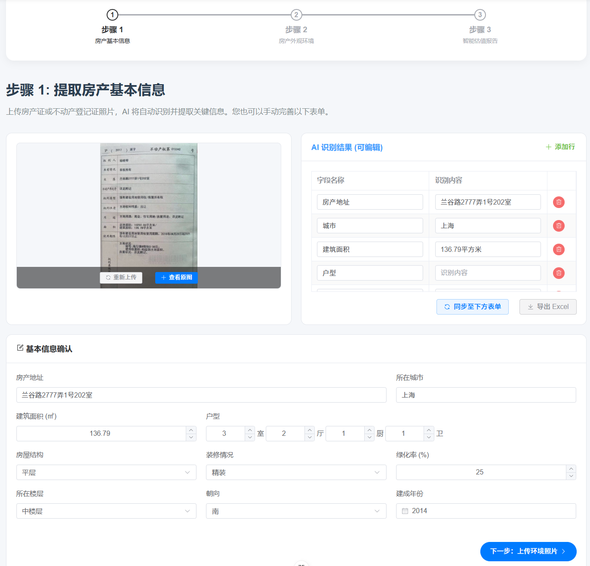
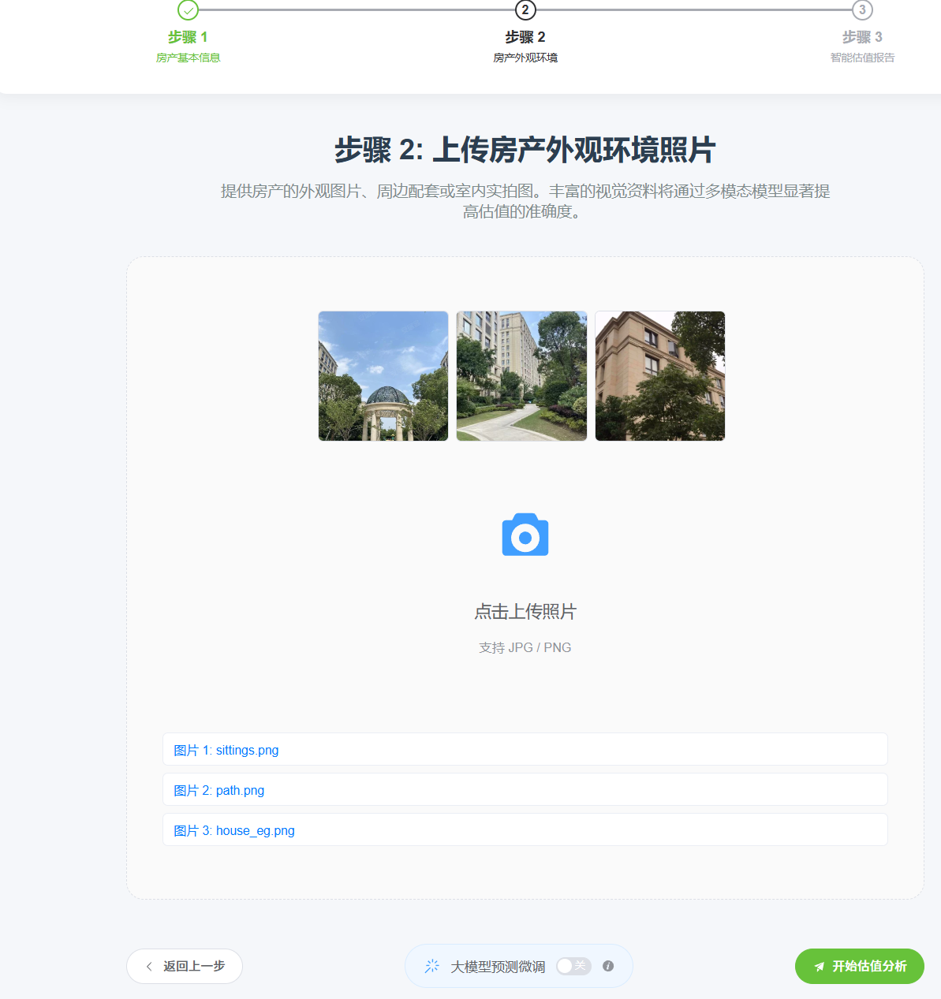
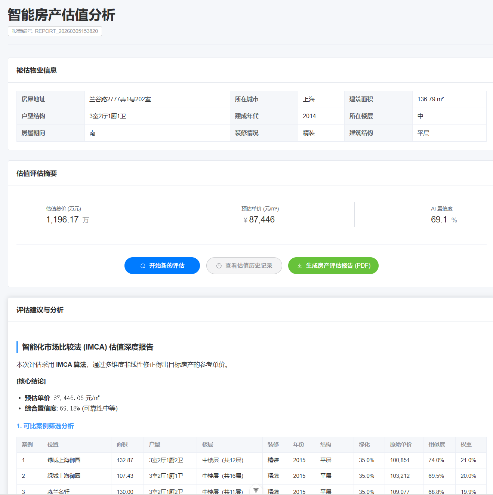

# “房估宝”——基于大语言模型的多模态智能房产价值评估系统

房估宝是一款基于人工智能的房产估值应用，旨在为用户提供快速、准确的房产价值评估服务。通过OCR技术识别房产证信息，结合AI智能分析和大语言模型，以及多维度市场数据，用户可以在短时间内获得专业的房产估值报告。

## 功能特点

*   **AI 智能识别**：利用 OCR 技术自动识别房产证信息，减少手动输入。
*   **多维度估值**：
    *   **市场比较法 (IMCA)**：基于周边同类型房产的市场数据进行对比分析。
    *   **大模型预测**：结合 LLM (Large Language Model) 进行区域和房产价值分析。
*   **专业报告生成**：生成详细的估值报告，包含价格区间、价值构成分析、市场趋势等。
*   **历史记录管理**：保存用户的估值历史，方便随时回顾和比较。
*   **现代化交互界面**：基于 Vue 3 + Element Plus 构建的响应式前端界面。

## 系统架构

本项目采用前后端分离架构：
*   **后端 (Backend)**: `Snaprop_Instant/` - 基于 Python Flask，负责业务逻辑、AI 模型调用、OCR 处理和数据存储。
*   **前端 (Frontend)**: `house-frontend/` - 基于 Vue 3 + Vite，提供用户交互界面。

### 技术栈

**前端:**
*   Vue 3 (Composition API)
*   Vite
*   Element Plus (UI 组件库)
*   Vue Router
*   Markdown-it (渲染报告内容)

**后端:**
*   Python 3.x
*   Flask (Web 框架)
*   MySQL (关系型数据存储)
*   ChromaDB (向量数据库，用于 RAG)
*   Alibaba Cloud OCR (房产证识别)
*   Pandas / OpenPyXL (数据处理)
*   LLM Integration (Qianwen, Baidu 等)

## 运行项目

### 前置要求

*   **Node.js**: >= 20.0 (推荐)
*   **Python**: >= 3.10
*   **MySQL**: 数据库服务
*   **API Keys**: 百度地图API, 阿里云 OCR、相关 LLM 服务的 API Key

### 1. 后端配置与启动

进入后端目录：
```bash
cd Snaprop_Instant
```

安装依赖：
```bash
pip install -r requirements.txt
```

配置环境：
*   确保 `config/` 目录下的配置文件（如 `mysql_config.py`, `ocr_config.py`, `qianwen_config.py` 等）已正确填入您的 API Key 和数据库连接信息, 确保`llm_prediction/config.py` 中的环境变量已设置(或者直接在代码中填入)。
*   初始化数据库结构（导入 `sitp.sql` 到您的 MySQL 数据库）。

启动服务：
```bash
cd Snaprop_Instant
python app.py
```
后端服务默认运行在 `http://127.0.0.1:5000`。

### 2. 前端配置与启动

进入前端目录：
```bash
cd house-frontend
```

安装依赖：
```bash
npm install
```

启动开发服务器：
```bash
npm run dev
```
前端服务默认运行在 `http://localhost:5173`。

访问浏览器中的前端地址即可开始使用。

## 目录结构说明

```
├── house-frontend/        # 前端项目源码
│   ├── public/            # 静态资源
│   ├── src/
│   │   ├── api.js         # API 接口定义
│   │   ├── views/         # 页面视图组件
│   │   ├── components/    # 公共组件
│   │   ├── router/        # 路由配置
│   │   └── ...
│   ├── vite.config.js     # Vite 构建配置
│   └── ...
├── Snaprop_Instant/       # 后端项目源码
│   ├── app.py             # Flask 应用入口
│   ├── database/          # 数据库管理
│   ├── llm/               # 大语言模型接口
│   ├── ocr/               # OCR 识别模块
│   ├── price/             # 估值算法核心
│   ├── report/            # 报告生成模块
│   └── ...
└── README.md
```

## 使用流程
1. 用户上传房产证照片。
2. 后端 OCR 模块识别照片中的信息。
3. 同步OCR识别信息到基本信息填写界面，用户确认或修改后提交。
4. 用户上传房产外观照片
5. 后端根据用户输入的信息和照片进行估值分析，调用市场比较法和大模型预测。
6. 用户可点击按钮，填写信息后生成估值报告并返回前端展示。

## 前端界面截图
- 主页


- Step1


- Step2


- Step3


## 常见问题
Q: 为什么我的照片无法识别?
A: 请确保光线充足，文字清晰，并且房产证放置在取景框内。

Q: 估值结果与实际价格相差较大怎么办?
A: 估值结果受多种因素影响，仅供参考。建议结合实地考察和专业意见。

Q: 我的城市/地区不在支持范围内怎么办?
A: 当前版本支持的城市有限，我们正在不断扩大覆盖范围。

*免责声明：本应用提供的估值仅作参考，不构成任何投资建议。用户在进行房产交易决策时，应结合实地考察和专业意见。*